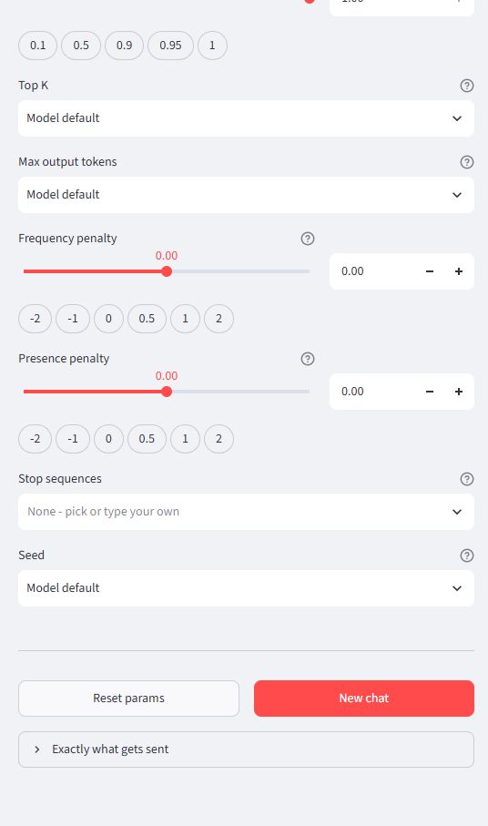
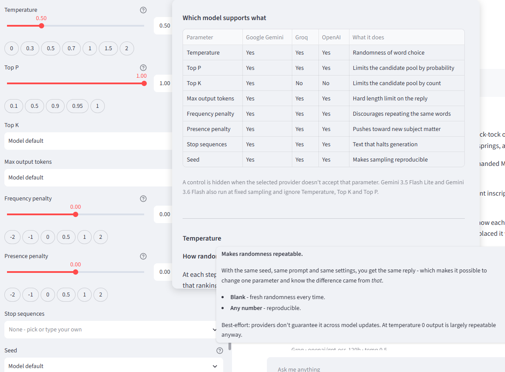

# Multi-Model Chat Assistant

A chat app for **comparing language models side by side**. Switch provider and model
mid-conversation, tune all eight sampling parameters live, and watch how each one
changes the reply — with the conversation kept intact the whole time.

Built on LangChain 1.0 + LangGraph, with a Streamlit interface.

```
┌──────────────────────────┬──────────────────────────────────────────────┐
│ Provider  [Google ▾]     │  💬 Chat Assistant                           │
│ Model     [3.7-flash ▾]  │  Google Gemini · gemini-3.7-flash            │
│                          │                                              │
│ Parameters          (ℹ️) │   You:  My name is Manasa                    │
│                          │   Bot:  Nice to meet you, Manasa!            │
│ Temperature   [0.50]     │         Google Gemini · gemini-3.7-flash     │
│ ──────●───────           │                                              │
│ (0)(0.3)(0.5)(0.7)(1)(2) │   You:  What's my name?      ← after moving  │
│                          │   Bot:  Your name is Manasa.    the slider   │
│ Top P         [1.00]     │                                              │
│ ───────────●             │                                              │
│                          │                                              │
│ Top K      [default ▾]   │                                              │
│ Max tokens [default ▾]   │                                              │
│ Stop seqs  [ ×END      ] │                                              │
│ Seed       [42        ▾] │                                              │
│                          │                                              │
│ [Reset params][New chat] │  ┌────────────────────────────────────────┐  │
│ ▸ Exactly what gets sent │  │ Ask me anything...                     │  │
└──────────────────────────┴──└────────────────────────────────────────┘──┘
```

---

## What it does

**1. Model switching.** Three providers, 18 models. The provider list builds itself
from which API keys are in `.env` — no key, no entry, so you can never pick something
that will fail on auth.

**2. Live parameter control.** All eight sampling parameters, each with a slider *and*
a typed box *and* clickable presets. Change one, send a message, see the difference.

**3. Honest capability handling.** Not every model accepts every parameter. Controls
that wouldn't apply are hidden rather than silently ignored, and an ℹ️ panel explains
which model supports what.

**4. Memory that survives everything.** Change a parameter, switch models, switch
providers — the conversation carries on. This is the hard part, and it's the reason
the code is shaped the way it is.

---

## Setup

```bash
python -m venv .venv
.venv\Scripts\activate
pip install -r requirements.txt
copy .env.example .env
```

Add at least one key to `.env`:

| Provider | Key | Where | Cost |
|----------|-----|-------|------|
| Google Gemini | `GOOGLE_API_KEY` | [aistudio.google.com/apikey](https://aistudio.google.com/apikey) | Free tier |
| Groq | `GROQ_API_KEY` | [console.groq.com/keys](https://console.groq.com/keys) | Free tier |
| OpenAI | `OPENAI_API_KEY` | [platform.openai.com](https://platform.openai.com/api-keys) | Paid |

```bash
.venv\Scripts\python.exe -m streamlit run app.py    # the app
.venv\Scripts\python.exe cli.py                     # terminal version
.venv\Scripts\python.exe test_params.py             # verify everything works
```

> **Editing `config.py` or `chatbot.py` requires restarting the server.** Streamlit
> hot-reloads `app.py` but keeps imported modules cached, so changes to the others
> won't appear until you restart.

---

## Screens

### The main view


Everything that shapes the request lives in the sidebar; the conversation fills the
rest. Under the model picker sits a note about the current selection — here,
*"The only provider offering top_k. Uses max_output_tokens natively."*

Look at the caption under each reply: **`Groq · openai/gpt-oss-120b · temp 0.5`**,
while the sidebar shows **Google Gemini** selected. That's not a glitch — it's the
point. Those replies were generated by Groq, then the provider was switched. Each
message keeps a record of what produced it, so a transcript spanning several models
stays readable afterwards. The conversation itself carried across the switch intact.

### Parameter controls


Every continuous parameter gives you three ways to set it: **drag the slider**, **type
an exact value** in the box, or **click a preset**. All three stay in sync.

Temperature offers 0 / 0.3 / 0.5 / 0.7 / 1 / 1.5 / 2; Top P offers 0.1 / 0.5 / 0.9 /
0.95 / 1. Top K and Max output tokens are dropdowns that start at *"Model default"* —
meaning the app sends nothing at all and the model's own default applies. Both accept
a typed value if the presets don't suit.

Select OpenAI or Groq and **Top K vanishes from this list**, because neither accepts it.

### The rest of the controls



Frequency and presence penalties run −2 to 2 with their own presets. **Stop sequences**
is a multi-select — pick several, or type your own. **Seed** offers common values or
any number you like.

**Reset params** restores every default; **New chat** starts a fresh conversation
thread without touching your settings. **Exactly what gets sent** expands to show the
literal keyword arguments handed to the provider — the quickest way to confirm a
parameter is really being applied:

```jsonc
// Gemini - everything native
{"temperature": 0.5, "top_k": 40, "max_output_tokens": 256, "seed": 42}

// Groq - renamed, and half of it nested
{"temperature": 0.5, "max_tokens": 256,
 "model_kwargs": {"top_p": 1.0, "seed": 42}}
```

### The ℹ️ support table and tooltips



The ℹ️ button beside "Parameters" opens a full support matrix — every parameter
against every provider. Note the **Top K** row: *Yes* for Gemini, *No* for Groq and
OpenAI. That table is generated from the same data structure that decides which
controls to render, so it can never disagree with what the app actually does.

Every control also has its own ⓘ tooltip explaining what it does to the output. The
one shown here is Seed: *"Makes randomness repeatable… Best-effort: providers don't
guarantee it across model updates."* Each ends with a suggested experiment.

---

## How it works

### The pieces

| File | Role |
|------|------|
| `config.py` | **The brain.** Providers, models, parameter specs, capability matrix |
| `chatbot.py` | Builds agents, holds the shared memory, streams replies |
| `app.py` | The Streamlit UI — renders itself from `config.py` |
| `cli.py` | Terminal version, defaults only |
| `test_params.py` | Automated proof that parameters actually reach the models |
| `TESTING.md` | Manual test cases + known quirks |

### The one design decision that matters

`create_agent()` bakes the model into the agent. So **every parameter change requires
building a new agent** — and a naive implementation loses the conversation each time
you nudge a slider.

The fix is to give the agent and the memory different lifetimes:

```python
# chatbot.py - one module-level store, never rebuilt
_CHECKPOINTER = MemorySaver()

def build_agent(provider, model_name, settings):
    return create_agent(
        model=build_model(provider, model_name, settings),  # new every time
        checkpointer=get_checkpointer(),                    # always the same
        ...
    )
```

History lives in the checkpointer keyed by `thread_id`, not in the agent. Rebuild the
agent as often as you like; the conversation doesn't notice. This is also why
switching *models* mid-chat works — messages are stored provider-neutral, so the next
model just receives the earlier turns as context.

### Three ways providers disagree

This is the messy reality the app exists to hide, all handled in `config.py`:

**1. Unsupported.** `top_k` doesn't exist on OpenAI or Groq. Those controls are hidden.

**2. Renamed.** Gemini wants `max_output_tokens`; OpenAI and Groq want `max_tokens`.

**3. Nested.** Groq accepts `top_p`, both penalties and `seed` at the REST level, but
`ChatGroq` doesn't declare them as fields — and it's configured with `extra="ignore"`.
Passing them directly is **silently discarded**: no error, no effect, a slider that
does nothing. They're routed through `model_kwargs` instead.

There's a fourth case that's per-*model* rather than per-provider: `gemini-3.5-flash-lite`
and `gemini-3.6-flash` run at fixed sampling and ignore Temperature/Top K/Top P even
though Gemini supports them. Selecting one hides those three and says why.

### Everything renders from one list

The sidebar, the tooltips and the support table are all generated by looping over
`PARAM_SPECS`. Adding a ninth parameter means adding one entry — no UI code changes.

---

## The eight parameters

| Parameter | Range | Default | What it changes |
|-----------|-------|---------|-----------------|
| Temperature | 0–2 | 0.5 | Randomness. 0 ≈ same answer every time |
| Top P | 0–1 | 1.0 | Trims candidates by probability mass |
| Top K | ≥1 | unset | Trims candidates by count. **Gemini only** |
| Max output tokens | ≥1 | unset | Hard length cap — cuts off mid-sentence |
| Frequency penalty | −2–2 | 0 | Discourages repeating words |
| Presence penalty | −2–2 | 0 | Pushes toward new topics |
| Stop sequences | list | empty | Halts generation at these strings |
| Seed | int | unset | Makes sampling reproducible |

Hover any control's ⓘ for a fuller explanation with a suggested experiment.

---

## Verified status

From `test_params.py` plus a sweep of every model:

**Models: 16 of 18 working.** Groq 7/7, OpenAI 4/4, Google 5/7 — the two Gemini
failures are free-tier quota, not defects.

**Parameters: zero failures on all three providers.** The suite distinguishes *"our
code dropped it"* (FAIL) from *"it was sent and the model ignored it"* (WARN) by
inspecting the actual payload. No FAILs anywhere.

### Quirks found while testing

| Thing | Explanation |
|-------|-------------|
| `gemini-3.8-flash` returns 429 | **20 requests/day** free tier, counted per model. Switch models to keep working |
| Gemini 3.x isn't deterministic at temperature 0 | Measured: temp 0, top_p 0.05, top_k 1 and a fixed seed all still varied. Reasoning models. **Use Groq or OpenAI when you need repeatability** |
| Groq ignores `presence_penalty` on `gpt-oss-120b` | Model-side — confirmed against Groq's own SDK |
| Very low max-tokens gives an *empty* reply | Reasoning models spend the budget thinking before emitting text |
| qwen models needed an output cap | 1000 output-tokens/minute limit; the app now applies 800 automatically |

---

## Extending it

**A ninth parameter** — add a `ParamSpec` to `PARAM_SPECS` and list its key in the
providers that accept it.

**A new provider** — add a `Provider` entry. Verify its capabilities rather than
guessing:

```python
from langchain_groq import ChatGroq
print(sorted(ChatGroq.model_fields))   # what it really accepts
```

**Tools / function calling** — define them with `@tool` and pass to
`create_agent(tools=[...])` in `chatbot.py`.

**Persistent history** — swap `MemorySaver` for
`langgraph.checkpoint.sqlite.SqliteSaver`.

**Tracing** — uncomment the LangSmith keys in `.env` to see every call, token count
and latency at smith.langchain.com.

> **Model IDs go stale.** Groq in particular retires models often. Every model
> dropdown accepts a typed ID, so a stale list never blocks you.

---

## Author

Built by **Manasa** — [github.com/manasa-velagaleti](https://github.com/manasa-velagaleti)
