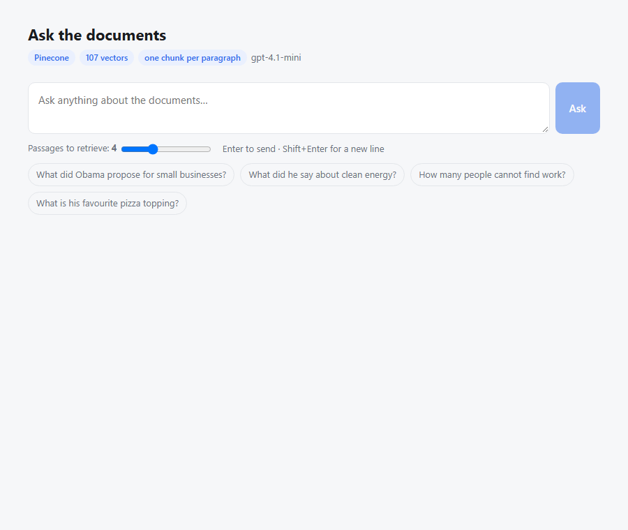

# RAG web UI

A web page for asking questions about the documents in `docs/`, answered by the
Pinecone RAG. React frontend, FastAPI backend.



## Run it

```bash
.venv\Scripts\python.exe rag_web/server.py
```

Then open **http://localhost:8000**

The Pinecone index must already exist. If the header shows an error, build it:

```bash
.venv\Scripts\python.exe embeddings_app/rag_pinecone.py --build
```

## Using it

Type a question and press **Enter** (Shift+Enter for a new line), or click one of
the example questions. Answers appear newest-first with the passages they came
from underneath — score, source file, paragraph number, and the text itself.
Long paragraphs are clipped with a "Show full paragraph" toggle.

The **⚙ Chunks** button opens a settings dialog with two controls.

**Chunk size** — how the documents are cut up before being embedded. Smaller
chunks are more precise, larger ones carry more context:

| Setting | Chunks | Sizes |
|---------|--------|-------|
| By paragraph | 107 | 20–1,172 chars |
| 300 characters | 196 | 24–299 |
| 500 characters | 122 | 45–498 |
| 700 characters | 81 | 101–698 |
| 1000 characters | 56 | 260–997 |

Chunk size is decided when the index is built, not when you ask — so each
setting has to be embedded once. The dialog shows what each would produce
*before* you pay for it, with a **Build** button and the cost (about $0.0002).

Each setting lives in **its own Pinecone namespace**, so once built it stays
built: switching between them afterwards is instant and free. The row you're
using is highlighted.

**Passages per question** — `k`, how many chunks get retrieved and handed to the
model. 3–5 suits most questions; raise it when answers come back thin.

## How it fits together

```
browser  ──POST /api/ask──>  server.py  ──>  rag_pinecone.ask()
   ▲                                              │
   │                                              ├─> Pinecone   (retrieve k chunks)
   └──── {answer, sources[]} ────────────────────┴─> gpt-4.1-mini (generate)
```

**No RAG logic lives here.** `server.py` calls `rag_pinecone.ask()` — the same
function the CLI uses. The web page and the terminal therefore give identical
answers, and changing the prompt or retrieval in one changes both.

Making that possible needed one small refactor: `rag_pinecone.answer()` used to
print its results, so a web version would have had to rebuild the retrieval and
prompting around a different output. It was split into `ask()` (returns data) and
`answer()` (prints it), and both callers use `ask()`.

### Endpoints

| | |
|---|---|
| `GET /` | the page |
| `GET /api/status` | index name, vector count, models — fills the header |
| `POST /api/ask` | `{question, k}` → `{answer, sources[]}` |

Try the API directly:

```bash
curl -X POST http://localhost:8000/api/ask ^
  -H "Content-Type: application/json" ^
  -d "{\"question\":\"What about clean energy?\",\"k\":3}"
```

## React with no build step

`static/index.html` is a single file. React, ReactDOM and Babel load from a CDN,
and Babel compiles the JSX in the browser:

```html
<script src="https://unpkg.com/react@18/umd/react.production.min.js"></script>
<script src="https://unpkg.com/react-dom@18/umd/react-dom.production.min.js"></script>
<script src="https://unpkg.com/@babel/standalone/babel.min.js"></script>
...
<script type="text/babel">
```

Real React — components, `useState`, `useEffect`, props. But **no npm, no
node_modules, no bundler**. Edit the file, refresh the browser, done.

The trade-offs, so they're not a surprise:

- **Needs an internet connection** for the three CDN scripts
- **Babel compiles on every load**, adding a moment to first paint
- **One file**, so it doesn't split into component files as it grows

For a local tool that's a good deal. A production app would precompile with Vite
and drop Babel entirely — the component code transfers over largely unchanged.

## Components

| | |
|---|---|
| `App` | State, the ask box, the `k` slider, fetch calls |
| `Result` | One question + its answer, or a loading or error state |
| `Source` | One retrieved passage, with score bar and expand toggle |

## Notes

**The store is opened once**, not per request — it holds an embeddings client and
a Pinecone connection. It's created lazily so the server still starts and can
report the problem when Pinecone is unreachable.

**Errors return as JSON rather than HTTP 500**, so the page can show what went
wrong instead of a blank failure.

**Dark mode** follows your OS setting via `prefers-color-scheme`.

**Local only** — bound to `127.0.0.1` with no auth. Don't expose it as-is.
